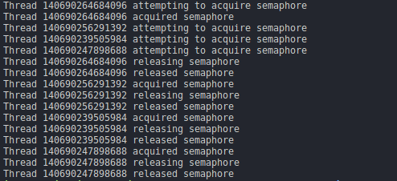
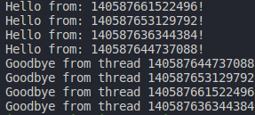

# synchronization-library
A basic implementation of a synchronization library for the C programming language.

## Table of contents
-[Pre-requisites](#pre-requisites)

-[Installation](#installation)

-[Usage](#usage)

-[Examples](#examples)

## Pre-requisites
- Linux Operating System - In conformance with POSIX.
- GCC compiler installed in your distro.
- Make tool installed in your distro.

## Installation

## Usage
The **semaphore** synchronization primitve allows for the synchronization of threads on crytical
sections of the code, it allows threads to **acquire** and **release** a resource.

The **barrier** synchronization primitive allows threads to synchronize at an specific point
and continue their execution **once** every thread reaches a certain point.  

## Examples

### Running the test file for the semaphore
Try running it by issuing **./testsemaphore** on your terminal

### Running the test file for barrier

Try running it by issuing **./testbarrier** on your terminal

